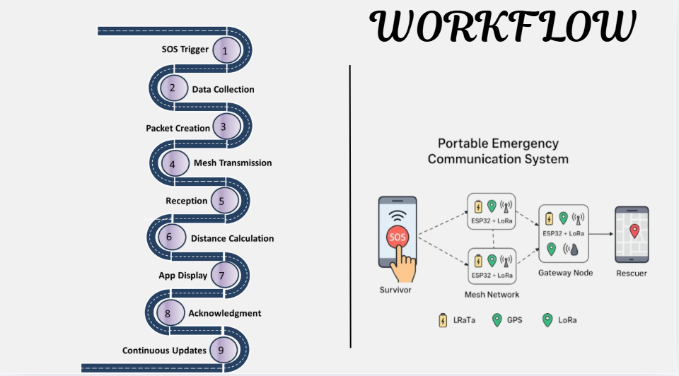
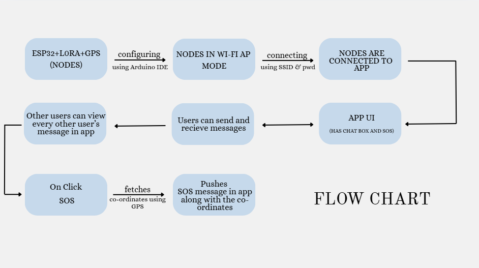

# Portable Emergency Communication Node

## Overview
A battery-powered LoRa mesh communication system designed to provide reliable communication and GPS-based location sharing during emergency and disaster situations where conventional cellular networks are unavailable.

## Problem Statement
Communication networks often fail during natural disasters, making coordination and location tracking of rescue teams difficult. This project provides a decentralized communication system using LoRa technology, enabling real-time communication and GPS location sharing without relying on GSM or internet connectivity.

## Key Features
- LoRa-based long-range mesh communication
- GPS-based real-time location sharing
- Rescue team-to-team communication
- Battery-powered portable device
- Emergency message transmission
- Mobile application interface
- Operates without GSM or internet connectivity
- Low-power operation for extended field use

## Technologies Used

### Hardware
- ESP32
- LoRa Module
- GPS Module
- Battery Management System
- Power Supply

### Software
- Arduino IDE
- Node.js
- HTML
- CSS
- JavaScript

## System Workflow

The workflow illustrates how each communication node acquires GPS coordinates, exchanges messages and location information with nearby rescue teams using LoRa communication, and displays the received information through the monitoring application.

## System Flowchart

The flowchart illustrates the complete operation of the system, including device initialization, GPS location acquisition, LoRa communication establishment, message transmission and reception, location sharing between rescue teams, and continuous monitoring.

## Results

Successfully established reliable long-range communication between multiple rescue teams, enabling real-time message exchange and GPS-based location sharing without requiring cellular or internet connectivity.

## Future Scope

- Voice communication support
- SOS emergency broadcasting
- Interactive rescue coordination dashboard
- Integration with drone-assisted search and rescue
- Large-scale LoRa mesh network deployment
